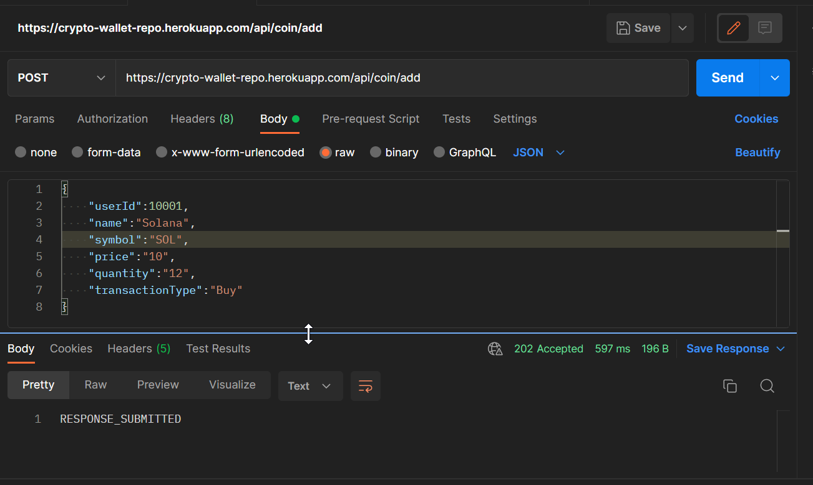

# Social-app

Minimal [Spring Boot](http://projects.spring.io/spring-boot/) sample app.

## Requirements

For building and running the application you need:

- [JDK 1.8](http://www.oracle.com/technetwork/java/javase/downloads/jdk8-downloads-2133151.html)
- [Maven 4](https://maven.apache.org)

## Running the application locally

There are several ways to run a Spring Boot application on your local machine. One way is to execute the `main` method in the `de.codecentric.springbootsample.Application` class from your IDE.

Alternatively you can use the [Spring Boot Maven plugin](https://docs.spring.io/spring-boot/docs/current/reference/html/build-tool-plugins-maven-plugin.html) like so:

```shell
mvn spring-boot:run
```

# Api Collection

- List
  - https://crypto-wallet-repo.herokuapp.com/api/user/signup
  - https://crypto-wallet-repo.herokuapp.com/api/user/authenticate
  - https://crypto-wallet-repo.herokuapp.com/api/user/logout
  - https://crypto-wallet-repo.herokuapp.com/api/coin/add
  - https://crypto-wallet-repo.herokuapp.com/api/coin/get/{username}

# Samples





  
# Test Server 

- [Test url](https://crypto-wallet-repo.herokuapp.com/api/user/test)
- This will give 
- Response of test user's data


